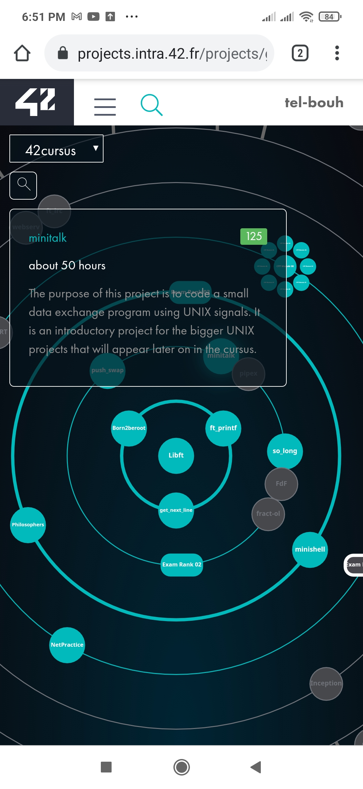

# Minitalk: the sixth pjoject in 42 cursus.

The aim of this project is esatablish a connection beween to process (a client and a server).
## Table of contents

- [ Minitalk: ](#the-sixth-pjoject-in-42-cursus.)
  - [Table of contents](#table-of-contents)
  - [Overview](#overview)
  - [The project](#the-project)
  - [Screenshot](#screenshot)

## Overview

The purpose of this project is to code a small data exchange program using UNIX signals.

### The project

- Create a communication program in the form of a client and a server.
• The server must be started first. After its launch, it has to print its PID.
• The client takes two parameters:
◦ The server PID.
◦ The string to send.
• The client must send the string passed as a parameter to the server.
  Once the string has been received, the server must print it.
• The server has to display the string pretty quickly. Quickly means that if you think
  it takes too long, then it is probably too long.

### Screenshot

